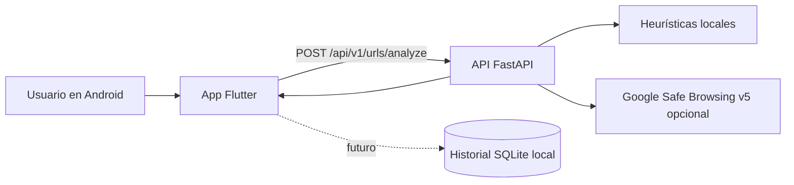

# ProtegeLink

ProtegeLink es una aplicación académica Android que ayuda a revisar enlaces antes de abrirlos y comunica el riesgo con palabras claras. Está orientada principalmente a adultos mayores.

> ProtegeLink es un proyecto educativo, no un antivirus ni un producto comercial. Ningún análisis puede garantizar la detección del 100 % de los sitios fraudulentos.

## Problema

Los enlaces fraudulentos suelen imitar servicios conocidos y usar mensajes urgentes. Las personas adultas mayores pueden tener más dificultades para interpretar señales técnicas o advertencias poco claras.

## Objetivo

Analizar una URL antes de permitir su navegación y clasificarla como `SAFE`, `SUSPICIOUS` o `DANGEROUS`. La aplicación explica los motivos sin depender solo del color.

## Alcance académico

El alcance actual es Android 10 o superior. No incluye iOS, web, cuentas de usuario, autenticación, panel administrativo, base de datos remota ni inteligencia artificial generativa.

## Arquitectura



La app nunca consulta Google directamente: el backend protege la clave y combina la reputación externa con reglas sencillas y explicables.

## Estructura del proyecto

- `mobile/`: aplicación Flutter Android-first, navegación y cliente REST.
- `backend/`: API FastAPI, motor heurístico e integración opcional con Safe Browsing.
- `docs/`: arquitectura y límites del proyecto.
- `scripts/`: comandos auxiliares para desarrollo local.

## Requisitos

- Flutter estable con Dart compatible.
- Android SDK con una plataforma Android reciente y Java compatible con Flutter.
- Python 3.10 o superior.
- Git.

## Levantar el backend

En PowerShell, desde la raíz:

```powershell
cd backend
python -m venv .venv
.\.venv\Scripts\Activate.ps1
python -m pip install --upgrade pip
python -m pip install -e ".[dev]"
Copy-Item .env.example .env
uvicorn app.main:app --reload --host 0.0.0.0 --port 8000
```

Comprobación: abrir `http://127.0.0.1:8000/health` o ejecutar `Invoke-RestMethod http://127.0.0.1:8000/health`.

Calidad del backend:

```powershell
ruff check .
ruff format --check .
pytest
```

## Ejecutar Flutter

Desde la raíz:

```powershell
cd mobile
flutter pub get
dart format .
flutter analyze
flutter test
flutter run --dart-define=API_BASE_URL=http://10.0.2.2:8000
```

`10.0.2.2` apunta a la computadora anfitriona desde el emulador Android. La URL por defecto de desarrollo es `http://10.0.2.2:8000`; no es una URL de producción.

## Celular Android real

`localhost` en el teléfono es el propio teléfono, no la computadora. Ambos dispositivos deben estar en la misma red local y el firewall debe permitir el puerto 8000. Se debe pasar la IP local de la computadora, por ejemplo:

```powershell
flutter run --dart-define=API_BASE_URL=http://192.168.1.100:8000
```

`192.168.1.100` es solo un ejemplo; reemplazarlo por la IP real del equipo.

## Variables de entorno

El backend lee `GOOGLE_SAFE_BROWSING_API_KEY`. Copiar `backend/.env.example` a `backend/.env` y agregar una clave solo si se desea habilitar el proveedor. Sin clave, el backend sigue funcionando únicamente con heurísticas.

La app lee `API_BASE_URL` mediante `--dart-define`. No se deben guardar URLs de producción en el código.

## Integración Android preparada

El manifiesto declara `INTERNET` y filtros no verificados para recibir enlaces HTTP/HTTPS y texto compartido. Esto permite evolucionar la integración sin solicitar todavía de forma agresiva el rol de navegador predeterminado. La recepción completa del intent y la solicitud de `RoleManager.ROLE_BROWSER` quedan para una iteración posterior.

## Estado actual

- [x] estructura base
- [x] navegación
- [x] backend FastAPI
- [x] análisis heurístico inicial
- [ ] integración completa Safe Browsing
- [ ] navegador predeterminado
- [ ] recepción automática de enlaces
- [ ] historial SQLite
- [ ] WebView protegido
- [ ] diseño final Stitch
- [ ] pruebas con dispositivo físico

## Seguridad y limitaciones

Los pesos heurísticos son demostrativos y ajustables. Una puntuación baja no prueba que un sitio sea legítimo. Safe Browsing se usa solo si hay una clave configurada y su respuesta puede fallar o no contener amenazas nuevas. La [API Safe Browsing v5](https://developers.google.com/safe-browsing/reference/rest/v5/urls/search) está destinada a usos no comerciales; para un producto comercial se debe revisar Google Web Risk y sus condiciones.

