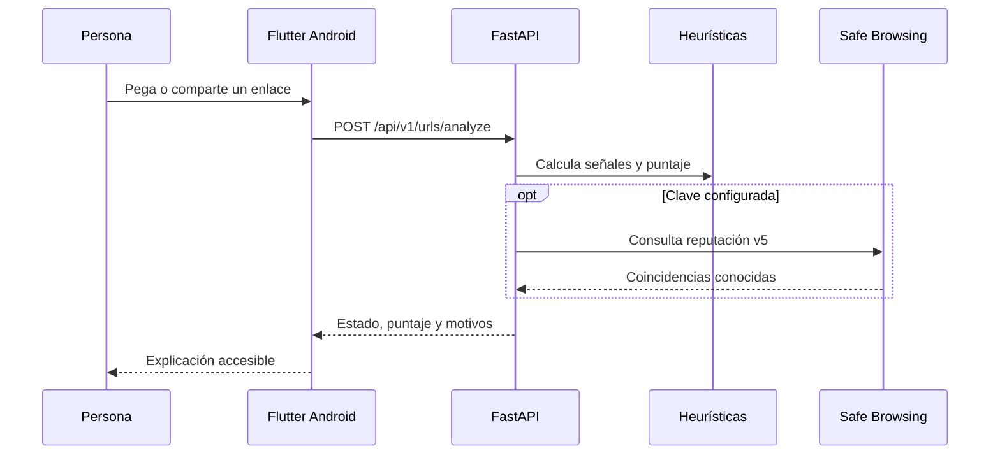

# Arquitectura de ProtegeLink

La arquitectura separa responsabilidades que sí tienen una razón práctica, sin agregar capas que el proyecto todavía no necesita.

## Flutter

Flutter construye la interfaz Android. La organización por funcionalidades mantiene juntas las pantallas, modelos y datos de cada caso de uso. Riverpod entrega dependencias y conserva el estado de la consulta. `go_router` concentra las rutas.

## FastAPI y API REST

FastAPI expone un contrato HTTP pequeño. La app envía JSON y recibe JSON; así el análisis puede evolucionar sin mezclar secretos o reglas de seguridad con la interfaz móvil.

## Análisis heurístico

Las heurísticas observan señales simples: HTTP sin cifrar, IP en lugar de dominio, longitud, subdominios, caracteres inusuales y palabras sensibles. Cada señal suma un peso visible en el código. No declara fraude por una sola palabra; produce una estimación explicable.

## Safe Browsing

El backend puede consultar Google Safe Browsing v5. La clave vive solo en variables de entorno. Si falta o el proveedor no responde, el análisis heurístico continúa. Una coincidencia positiva prevalece y marca el enlace como peligroso.

## Almacenamiento local

El historial se almacenará en SQLite dentro del teléfono. En esta primera base solo está definida la frontera del repositorio local; la persistencia se implementará en una clase posterior.

## Integración Android

`AndroidManifest.xml` prepara filtros para enlaces web y texto compartido. Una próxima iteración leerá los intents en Kotlin/Flutter y solicitará, con explicación previa, el rol oficial de navegador predeterminado en Android 10 o superior.

